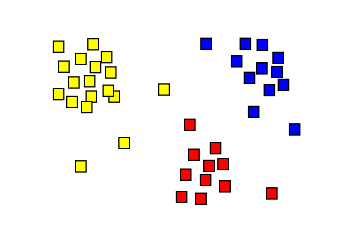

- title : Intro to Machine Learning with Dot Net 
- description : Machine Learning with Dot Net 
- author : Alan Barr 
- theme : white 
- transition : none 

*********************************

<section data-background-video="https://s3.amazonaws.com/www.alanmbarr.com/aibo.mp4" data-background-color="#000000" data-background-video-loop>
</section>
<table>
<tr><td class="noborder" style="width:75%;">
# 
Machine Learning .NET

</td><td class="noborder" style="width:25%;">
 
 
 
 
 
</td></tr><tr><td>
## 
Alan Barr

</td></tr>
</table>

**********************************

---

- data-background : #01cdfe

# What is Machine Learning?

---

- data-background : #ff71ce

<h1 style="color:white;">Isn't Machine Learning just statistics?</h1>

---

- data-background : #fffb96

# Warning... Clean Data required

- Garbage In Garbage Out
- Context is King 
- Big data is not necessarily helpful
- Overfitting - prediction is suspiciously good

---

- data-background : #01cdfe

### Classification 

- Classification : Who's a good dog (Breed)?
- What two or multiple categories does an item fit into

---

- data-background : #ff71ce

### Regression : values are continuous and have a constant slope

---

- data-background : #fffb96

### Clustering
- Identify a relationship between things without predefined labels
- Outlier/Anomaly detection

---

- data-background : #b967ff

### Recommendation

**************************************************************************

- data-background : #05ffa1

## Key Terms

* Features
* Model
* Supervised Learning, Unsupervised, Semi-supervised
* Model Validation 
* Over/Under fitting 

---

- data-background : #ff71ce

## Validating Models and Overfitting

* A model learns from examples
* We want our model to be robust enough to give us a prediction from unseen data
* We can use various tools to verify how well our model is performing
    - Cross Validation, Root Mean Squared Error, Receiver Operating Characteristic

---

- data-background : #fffb96

---

- data-background : #01cdfe

---

- data-background : #b967ff

# Tools

- Any language, many tutorials often use R or Python
- Data Frame library to ease data exploration
- In .Net: Accord Framework

---

- data-background : #01cdfe

# 
DEMO DEMO DEMO DEMO

# 
DEMO DEMO DEMO DEMO

# 
DEMO DEMO DEMO DEMO

# 
DEMO DEMO DEMO DEMO

# 
DEMO DEMO DEMO DEMO

# 
DEMO DEMO DEMO DEMO

# 
DEMO DEMO DEMO DEMO

# 
DEMO DEMO DEMO DEMO
